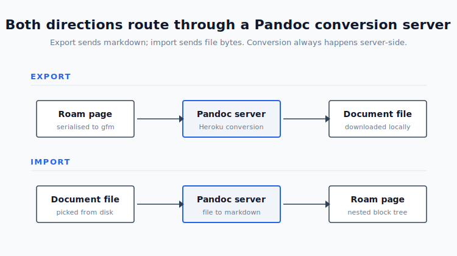

# Export or Import Document

Move text between Roam and real document formats in both directions. 
  - Export any page to `pdf`, `docx`, `epub`, `rtf`, `md`, `gfm`, or `opendocument`. 
  - Import `docx`, `odt`, `rtf`, `epub`, `html`, or `md` files from disk and land them in your graph as nested blocks with their heading structure intact.<br><br>

## Quickstart

1. Install from Roam Depot.
2. Open a page you want to export. Right-click the page title and pick **Export page as…**, or run **Export Document: [format]** from the Command Palette.
3. To import, run **Import Document into Graph…** from the Command Palette. Pick a file. A new page appears with the source document's structure mirrored as nested blocks.

The first export or import shows a one-time security dialog explaining that file content is sent to a conversion server. Dismiss it, or disable it permanently in settings.<br><br>

## How it works


*What this shows: both directions route through a Heroku-hosted Pandoc and TinyTeX server. Export serialises the Roam page to GFM markdown before sending. Import sends raw file bytes and receives normalised markdown, which the extension parses into a nested block tree.*

The server does the heavy lifting in both directions. The extension itself is responsible for walking Roam's block tree, serialising or parsing structure, and applying the result cleanly back to the graph.<br><br>

## Export

### Features

- Export triggers live in the **Command Palette** (every format) and the **Page Context Menu** (right-click the page title for a quick menu)
- Visual indicator runs while the server works, so long exports do not feel frozen
- Up to 15 levels of nesting preserved in PDFs (the old limit was 6)
- Linked References can be appended to the export, flattened or not, independently of the main page
- Augmented Headings integration: if the [Augmented Headings](https://github.com/mlava/augmented-headings) extension is installed, H4 through H6 headings are emitted as proper headings rather than falling back to plain text

### Supported export formats

| Format | Notes |
|---|---|
| `pdf` | Deepest nesting support; uses TinyTeX on the server |
| `docx` | Microsoft Word document |
| `epub` | e-book file format |
| `rtf` | Rich Text Format |
| `md` | Plain CommonMark |
| `gfm` | GitHub Flavored Markdown |
| `opendocument` | ODT-compatible XML |

### Settings (export)

All settings live under **Roam Depot > Settings > export-document**.

| Setting | What it does |
|---|---|
| **Exclude blocks with tag** | Blocks tagged with this string are dropped from the export. Leave blank to include everything. Example: set to `#private` to keep draft notes out of exported reports. |
| **Flatten page hierarchy** | Left-justifies every block. No indentation. Useful when the destination format does not render nested lists well (for example, `rtf` opened in minimal word processors). |
| **Export current view** | When on, command-palette exports use the block currently open in the main window (after clicking a bullet to zoom in) and its children, instead of resolving up to the parent page. The block's text becomes the document's H1 title. The command-palette labels rename from **Export Page as…** to **Export View as…** to match. If the main window shows a full page, this setting has no effect. Page-context-menu exports always export the whole page. |
| **Include Linked References** | Appends the Linked References section to the end of the export. |
| **Flatten Linked References** | Flattens hierarchy for the linked references section only. Independent of the main flatten setting, so you can keep structure in the main body and flatten references. |

<br>

## Import

### Features

- Import triggers live in the **Command Palette** (`Import Document into Graph…`) and the **Page Context Menu** (`Import Document as child of this page`)
- A native file dialogue opens on invocation — pick any local file
- The resulting page preserves the source document's structure as nested blocks
- Roam's native heading styles (H1, H2, H3) are reproduced from source headings
- H4 through H6 reproduce via the [Augmented Headings](https://github.com/mlava/augmented-headings) extension when installed. Without it, they silently fall back to plain text.
- Pipe tables become native Roam `{{table}}` blocks with cell chains
- Page-title collisions produce an `(Imported YYYY-MM-DD)` suffix. The extension never overwrites an existing page.

### Supported import formats

`docx`, `odt`, `rtf`, `epub`, `html`, `htm`, `md`.

PDF, PPTX, and XLSX are deliberately unsupported in this version. The server returns a clear error if you pick one — it does not silently mangle the content.

### Source to Roam mapping

| Source element | Becomes in Roam |
|---|---|
| H1 | Page title (or a top-level Roam H1 block if the H1 text does not match the page title) |
| H2, H3 | Nested blocks styled as native Roam H2 or H3 |
| H4, H5, H6 | Plain blocks, or Augmented Headings styles when that extension is installed |
| Paragraph | A block under the nearest heading |
| Bulleted list | Nested children. If the preceding paragraph ends with `:`, the list nests under that paragraph as a natural intro-and-items pair. |
| Numbered list | Same as bulleted — Roam has no native ordered-list semantics |
| Nested list (indented) | Multi-level child nesting via indentation |
| Blockquote | One block per `>` run; multi-line quotes stay together |
| Fenced code block | One block preserving the fence and language marker |
| Table | Roam `{{table}}` block with row chains |
| Inline `**bold**`, `*italic*`, `~~strike~~`, `` `code` `` | Preserved or converted to Roam's syntax |
| Footnotes | Stripped from inline text and collected into a trailing `## Footnotes` section |
| Images | Replaced with `[image: alt text]` placeholders. Image bytes are not transferred. |

### Limitations

- **File size cap:** 10 MB.
- **No image transfer.** Only the alt text is preserved. If you need the images, drag them into Roam after the import.
- **No rollback.** If an import produces the wrong structure, delete the new page and try again with different source formatting.
- **Italics become Roam's `__italic__` syntax.** Source `*italic*` or `_italic_` converts automatically.
- **Bold paragraphs in Word that are not true heading styles stay as bold paragraphs.** If you want them treated as headings on import, apply Word's Heading styles first.<br><br>

## Augmented Headings integration

If you run the [Augmented Headings](https://github.com/mlava/augmented-headings) extension alongside this one, both directions get better:

- **Export:** H4, H5, H6 in your graph are written as real headings in the output document
- **Import:** H4, H5, H6 in the source document are applied to the imported blocks through the Augmented Headings tool

There is nothing to configure. Install both extensions and the integration works automatically. Without Augmented Headings, H4 through H6 silently fall back to plain text on import and plain block text on export.<br><br>

## Shared settings

| Setting | What it does |
|---|---|
| **Hide Security Alert** | Suppresses the data-sharing confirmation dialog shown before the first export and first import. |

<br>

## Extension Tools API

Other extensions can drive both directions programmatically via `window.RoamExtensionTools["export-document"]`. The registry pattern follows the shared Extension Tools convention — a global namespace where each installed extension registers its own `tools` array and a few extra metadata fields.

### `ed_export` (read-only)

Export a Roam page to a document file. The file downloads to the user's browser.

```js
const result = await window.RoamExtensionTools["export-document"].tools
  .find(t => t.name === "ed_export")
  .execute({ page_uid: "abc123XYZ", format: "docx" });

// { success: true, filename: "My Page.docx" }
// or { error: "Invalid format. Must be one of: docx, epub, gfm, md, opendocument, pdf, rtf" }
```

| Parameter | Type | Required | Description |
|---|---|---|---|
| `page_uid` | string | yes | UID of the Roam page to export |
| `format` | string | yes | One of `docx`, `epub`, `gfm`, `md`, `opendocument`, `pdf`, `rtf` |

Settings (flatten, exclude tag, linked references) are read from Roam Depot configuration. The tool does not accept overrides — if a calling extension needs different behaviour, ask the user to change settings first.<br><br>

### `ed_import` (mutating)

Import a local document file into the graph. Opens a native file picker on invocation, so this tool cannot run fully headlessly. Use it to prompt the user for a file and then create pages programmatically.

```js
// Create a new top-level page from the picked file
await window.RoamExtensionTools["export-document"].tools
  .find(t => t.name === "ed_import")
  .execute({});

// Append the picked file as children of an existing page
await window.RoamExtensionTools["export-document"].tools
  .find(t => t.name === "ed_import")
  .execute({
    parent_page_uid: "someExistingPageUid",
    target_page_title: "Q3 Planning (appended)"
  });
```

| Parameter | Type | Required | Description |
|---|---|---|---|
| `target_page_title` | string | no | Override the page title derived from the document |
| `parent_page_uid` | string | no | Append imported content as children of this existing page or block instead of creating a new top-level page |

Returns `{ success: true, pageTitle, pageUid, blocksCreated, filename }` on success, or `{ error: "..." }` on failure.<br><br>

### `consentGiven` (boolean)

```js
if (!window.RoamExtensionTools["export-document"].consentGiven) {
  // User has not yet acknowledged the data-sharing notice.
  // Show your own prompt or trigger ed_export and let the extension handle it.
}
```

`consentGiven` reflects whether the user has dismissed the security alert at least once. Other extensions can read it to avoid a redundant consent prompt.<br><br>

## Privacy and data handling

Export and import both send file content to a Heroku-hosted Pandoc and TinyTeX server for conversion. The server is operated by the extension author, not shared with any third party beyond Heroku's hosting infrastructure, and retains no copies of the content it processes.

A confirmation dialog appears the first time you use either feature. You can suppress it permanently via the **Hide Security Alert** setting. Do not send documents you are not comfortable routing through a third-party server.<br><br>

## Credits

This extension builds on open source code originally written by [@TFTHacker](https://twitter.com/TfTHacker) and maintained by [David Vargas](https://github.com/dvargas92495), with their permission and blessing.

The conversion server runs [Pandoc](https://pandoc.org/) and [TinyTeX](https://yihui.org/tinytex/) on Heroku.<br><br>

## Troubleshooting

Long pages or large documents may take a few seconds to convert. The visual indicator stays up until the server responds. If something fails, an alert explains what went wrong.

For unexpected issues, open your browser console, copy any errors, and report them on the [GitHub repository](https://github.com/mlava/export-document/issues).
